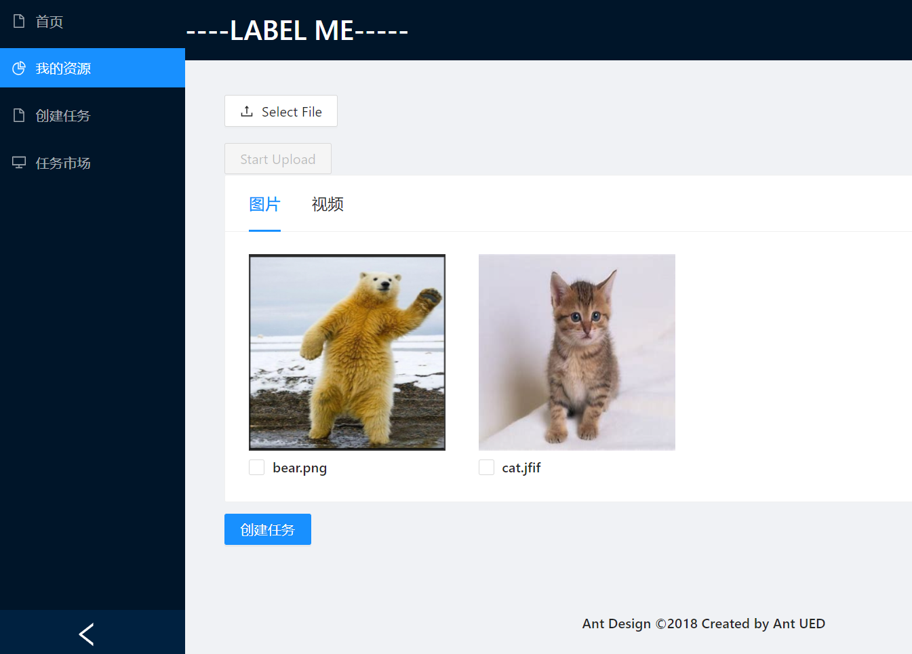

# CardList 可以切换

```
import React, { useState } from 'react';
import { Card,Checkbox } from 'antd';
import { Image } from 'antd';
import { Space, Typography, Row, Col,Divider } from 'antd';
import axios from 'axios';
import GlobalData from './globalData';
import 'antd/dist/antd.css';
import Uploads from './uploads';
import { Affix, Button } from 'antd'
import Create from './create';

const { Meta } = Card;

var items=[]
const tabList = [
  {
    key: 'tab1',
    tab: '图片',
  },
  {
    key: 'tab2',
    tab: '视频',
  },
];

function onChange(e) {
  if(e.target.checked){
    console.log(`checked = ${e.target.id}`);
  }
}
const contentList = {
  tab1: 
  <Row justify="cneter" gutter={[8, 16]}>
       {items}
    </Row>
     ,
  tab2:
  <Row justify="cneter" gutter={[8, 16]}>
      {items}
    </Row>,
};


class ShowPage extends React.Component {
  constructor(props){
    super(props);
    this.state={
      activeTabKey:'tab1'
    }
  }
  componentDidMount = () => {
    console.log("before:");
    console.log(items);
    items.length=0;
    console.log("after:");
    console.log(items);
    axios({
      url:'http://127.0.0.1:5000/myimg',
      data:{
          "user_id":GlobalData.userid
      },
      method:'POST'
      }).then(
          res => {
            // console.log(res);
            
            // console.log(res.data.data[0].id);
            // console.log(res.data.imgList);
            for (let i = 0; i < res.data.imgList.length; i++) {       
              items.push(
                <Col span={6}>
                  <Image
                    width={200}
                    height={200}
                    title="123"
                    // src="error"
                    fallback="data:image/png;base64,iVBORw0KGgoAAAANSUhEUgAAAMIAAADDCAYAAADQvc6UAAABRWlDQ1BJQ0MgUHJvZmlsZQAAKJFjYGASSSwoyGFhYGDIzSspCnJ3UoiIjFJgf8LAwSDCIMogwMCcmFxc4BgQ4ANUwgCjUcG3awyMIPqyLsis7PPOq3QdDFcvjV3jOD1boQVTPQrgSkktTgbSf4A4LbmgqISBgTEFyFYuLykAsTuAbJEioKOA7DkgdjqEvQHEToKwj4DVhAQ5A9k3gGyB5IxEoBmML4BsnSQk8XQkNtReEOBxcfXxUQg1Mjc0dyHgXNJBSWpFCYh2zi+oLMpMzyhRcASGUqqCZ16yno6CkYGRAQMDKMwhqj/fAIcloxgHQqxAjIHBEugw5sUIsSQpBobtQPdLciLEVJYzMPBHMDBsayhILEqEO4DxG0txmrERhM29nYGBddr//5/DGRjYNRkY/l7////39v///y4Dmn+LgeHANwDrkl1AuO+pmgAAADhlWElmTU0AKgAAAAgAAYdpAAQAAAABAAAAGgAAAAAAAqACAAQAAAABAAAAwqADAAQAAAABAAAAwwAAAAD9b/HnAAAHlklEQVR4Ae3dP3PTWBSGcbGzM6GCKqlIBRV0dHRJFarQ0eUT8LH4BnRU0NHR0UEFVdIlFRV7TzRksomPY8uykTk/zewQfKw/9znv4yvJynLv4uLiV2dBoDiBf4qP3/ARuCRABEFAoBEgghggQAQZQKAnYEaQBAQaASKIAQJEkAEEegJmBElAoBEgghggQAQZQKAnYEaQBAQaASKIAQJEkAEEegJmBElAoBEgghggQAQZQKAnYEaQBAQaASKIAQJEkAEEegJmBElAoBEgghggQAQZQKAnYEaQBAQaASKIAQJEkAEEegJmBElAoBEgghggQAQZQKAnYEaQBAQaASKIAQJEkAEEegJmBElAoBEgghggQAQZQKAnYEaQBAQaASKIAQJEkAEEegJmBElAoBEgghggQAQZQKAnYEaQBAQaASKIAQJEkAEEegJmBElAoBEgghggQAQZQKAnYEaQBAQaASKIAQJEkAEEegJmBElAoBEgghggQAQZQKAnYEaQBAQaASKIAQJEkAEEegJmBElAoBEgghggQAQZQKAnYEaQBAQaASKIAQJEkAEEegJmBElAoBEgghggQAQZQKAnYEaQBAQaASKIAQJEkAEEegJmBElAoBEgghggQAQZQKAnYEaQBAQaASKIAQJEkAEEegJmBElAoBEgghgg0Aj8i0JO4OzsrPv69Wv+hi2qPHr0qNvf39+iI97soRIh4f3z58/u7du3SXX7Xt7Z2enevHmzfQe+oSN2apSAPj09TSrb+XKI/f379+08+A0cNRE2ANkupk+ACNPvkSPcAAEibACyXUyfABGm3yNHuAECRNgAZLuYPgEirKlHu7u7XdyytGwHAd8jjNyng4OD7vnz51dbPT8/7z58+NB9+/bt6jU/TI+AGWHEnrx48eJ/EsSmHzx40L18+fLyzxF3ZVMjEyDCiEDjMYZZS5wiPXnyZFbJaxMhQIQRGzHvWR7XCyOCXsOmiDAi1HmPMMQjDpbpEiDCiL358eNHurW/5SnWdIBbXiDCiA38/Pnzrce2YyZ4//59F3ePLNMl4PbpiL2J0L979+7yDtHDhw8vtzzvdGnEXdvUigSIsCLAWavHp/+qM0BcXMd/q25n1vF57TYBp0a3mUzilePj4+7k5KSLb6gt6ydAhPUzXnoPR0dHl79WGTNCfBnn1uvSCJdegQhLI1vvCk+fPu2ePXt2tZOYEV6/fn31dz+shwAR1sP1cqvLntbEN9MxA9xcYjsxS1jWR4AIa2Ibzx0tc44fYX/16lV6NDFLXH+YL32jwiACRBiEbf5KcXoTIsQSpzXx4N28Ja4BQoK7rgXiydbHjx/P25TaQAJEGAguWy0+2Q8PD6/Ki4R8EVl+bzBOnZY95fq9rj9zAkTI2SxdidBHqG9+skdw43borCXO/ZcJdraPWdv22uIEiLA4q7nvvCug8WTqzQveOH26fodo7g6uFe/a17W3+nFBAkRYENRdb1vkkz1CH9cPsVy/jrhr27PqMYvENYNlHAIesRiBYwRy0V+8iXP8+/fvX11Mr7L7ECueb/r48eMqm7FuI2BGWDEG8cm+7G3NEOfmdcTQw4h9/55lhm7DekRYKQPZF2ArbXTAyu4kDYB2YxUzwg0gi/41ztHnfQG26HbGel/crVrm7tNY+/1btkOEAZ2M05r4FB7r9GbAIdxaZYrHdOsgJ/wCEQY0J74TmOKnbxxT9n3FgGGWWsVdowHtjt9Nnvf7yQM2aZU/TIAIAxrw6dOnAWtZZcoEnBpNuTuObWMEiLAx1HY0ZQJEmHJ3HNvGCBBhY6jtaMoEiJB0Z29vL6ls58vxPcO8/zfrdo5qvKO+d3Fx8Wu8zf1dW4p/cPzLly/dtv9Ts/EbcvGAHhHyfBIhZ6NSiIBTo0LNNtScABFyNiqFCBChULMNNSdAhJyNSiECRCjUbEPNCRAhZ6NSiAARCjXbUHMCRMjZqBQiQIRCzTbUnAARcjYqhQgQoVCzDTUnQIScjUohAkQo1GxDzQkQIWejUogAEQo121BzAkTI2agUIkCEQs021JwAEXI2KoUIEKFQsw01J0CEnI1KIQJEKNRsQ80JECFno1KIABEKNdtQcwJEyNmoFCJAhELNNtScABFyNiqFCBChULMNNSdAhJyNSiECRCjUbEPNCRAhZ6NSiAARCjXbUHMCRMjZqBQiQIRCzTbUnAARcjYqhQgQoVCzDTUnQIScjUohAkQo1GxDzQkQIWejUogAEQo121BzAkTI2agUIkCEQs021JwAEXI2KoUIEKFQsw01J0CEnI1KIQJEKNRsQ80JECFno1KIABEKNdtQcwJEyNmoFCJAhELNNtScABFyNiqFCBChULMNNSdAhJyNSiECRCjUbEPNCRAhZ6NSiAARCjXbUHMCRMjZqBQiQIRCzTbUnAARcjYqhQgQoVCzDTUnQIScjUohAkQo1GxDzQkQIWejUogAEQo121BzAkTI2agUIkCEQs021JwAEXI2KoUIEKFQsw01J0CEnI1KIQJEKNRsQ80JECFno1KIABEKNdtQcwJEyNmoFCJAhELNNtScABFyNiqFCBChULMNNSdAhJyNSiEC/wGgKKC4YMA4TAAAAABJRU5ErkJggg=="
                    src={"upload/img/"+res.data.imgList[i].name}
                  />
                  <br></br>
                  <Checkbox id={res.data.imgList[i].id} onChange={onChange}>{res.data.imgList[i].name}</Checkbox>
                </Col>
                );
          }
          console.log("afterpush:");
          console.log(items)
            // console.log(res.data.enterprise_info)
            // this.setState({en_list:res.data.enterprise_info})
            // this.setState({mat_list:res.data.data})
            
          }
      ).catch(
          err => console.error(err)
    )
  
  }

  onTabChange(key){
    this.setState({activeTabKey:key});
  }
  render(){
    return (
      <>
      
        <Uploads/>
        
     
        <Card
          style={{ width: '100%' }}
          // title="我的资源"
          // extra={<a href="#">More</a>}
          tabList={tabList}
          activeTabKey={this.state.activeTabKey}
          onTabChange={key => {
            this.onTabChange(key);
          }}
        >
          {contentList[this.state.activeTabKey]}
        </Card>
        
        <Create />
        
      </>
    )  
  }
  
};


export default ShowPage;
```

